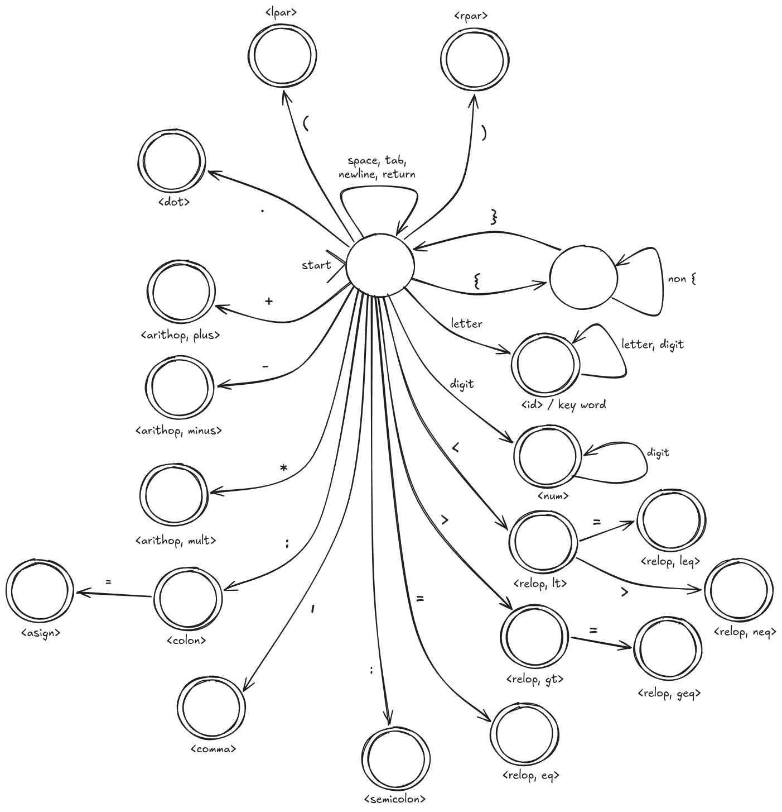

# Lexical Analyzer

The **Lexical Analyzer** is the first stage of the Mini Pascal Compiler. Its main responsibility is to read a Pascal source file and transform the input stream of characters into a sequence of tokens.

## 📘 Overview

This component processes the input file character by character, identifying meaningful patterns and grouping them into tokens. These tokens represent the basic elements of the language and are later used by subsequent stages of the compiler.

The analyzer recognizes, in a general way:

* Identifiers and numeric literals
* Reserved keywords of the language
* Arithmetic, relational, and logical operators
* Symbols used for program structure

Each recognized token is written to an output file, including its corresponding **token name** and, when applicable, its **attribute**.

## ⚙️ How It Works

The lexical analyzer follows a structured process based on a **finite automaton**, which defines how sequences of characters are interpreted as valid tokens.

As the input is scanned:

* Characters are read sequentially
* Transitions between states determine token recognition
* When a valid token is completed, it is emitted to the output

This approach allows the analyzer to systematically and efficiently process the source code.

## ▶️ Running the Analyzer

To execute the lexical analyzer, run the following command from this directory:

```bash
python3 lexical_analyzer.py test/test_case1
```

Additional test cases are provided in the `test` directory (e.g., `test_case2`, `test_case3`).
You can also provide your own Pascal source file as input to analyze different programs.

## 🖼️ Finite Automaton

The following automaton illustrates the structure used to recognize tokens in the lexical analysis process:


